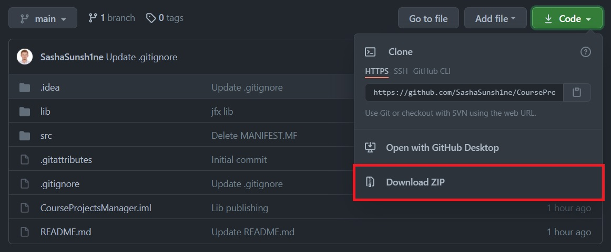
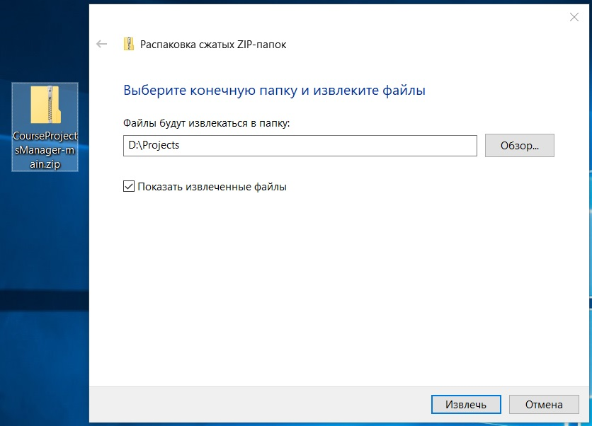
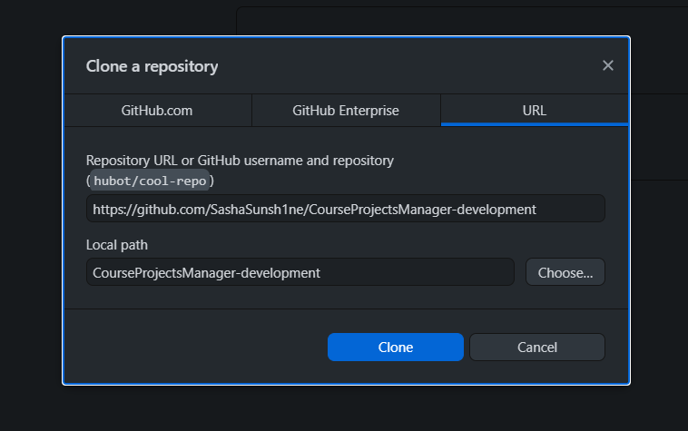
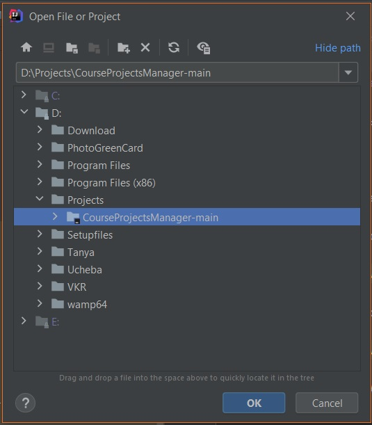
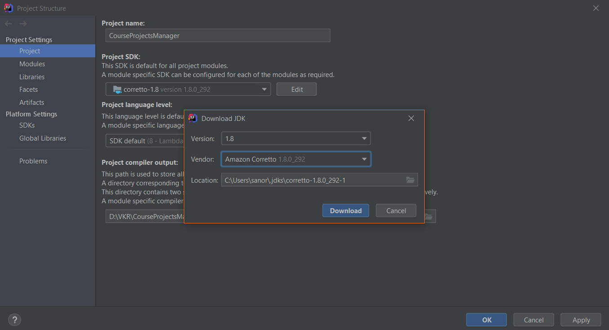
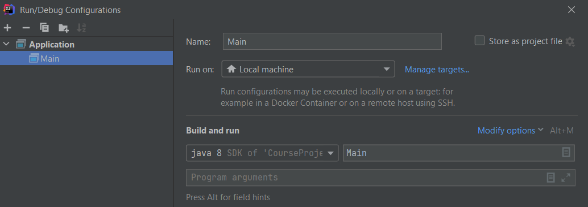
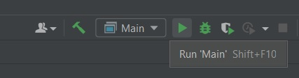

# CourseProjectsManager

### # Совместимость

Проект создан с помощью IDE IntelliJ IDEA на языке Java с помощью 
[JDK 8u291](https://www.oracle.com/java/technologies/javase/javase-jdk8-downloads.html)

Для корректной работы проекта необходимо установить на вашу ОС java версии 8.291
[JAVA Version 8 Update 291](https://www.java.com/download/ie_manual.jsp).

Убедиться с том какая версия Java используется на вашей Windows можно перейдя в раздел:
`Панель управления -> Java -> Вкладка Java -> View`. 
Перед вами появится табличка со всеми версиями Java, установленными на вашу ОС, 
необходимо выбрать включить только `Platform 1.8`.

### # Запуск проекта в IDE

Для запуска проекта необходимо:

1) Скачать проект и сохранить его

2) Распаковать архив с проектом в удобное место

3) Так же первые два этапа можно заменить на клонирование репозитория с помощью 
   GihHub по ссылке
   

4) В IDE IntelliJ IDEA перейти в `FILE > OPEN...`, выбрать путь, куда был распакован 
   проект, нажать на папку с проектом (CourseProjectsManager-development-main), 
   затем на кнопку `OK`

### # Настройка проекта

#### ## FILE > Project Structure

В IDE IntelliJ IDEA перейти в `FILE > Project Structure...`
На вкладке `Project` открывшегося окна необходимо выбрать версию Java 1.8.

Если ее нет в выборе, то переходим в `Download JDK...` и выбираем необходимую версию 
Java Development Kit, после чего ждем окончания загрузки и жмем `OK`

### # Запуск программы

Для запуска проекта в IDE IntelliJ IDEA необходимо перейти во вкладку 
`Run > Edit Configurations...` и добавить здесь новую конфигурацию:

После создания конфигурации можно запускать проект через вкладку 
`Run > Run 'Main'`

