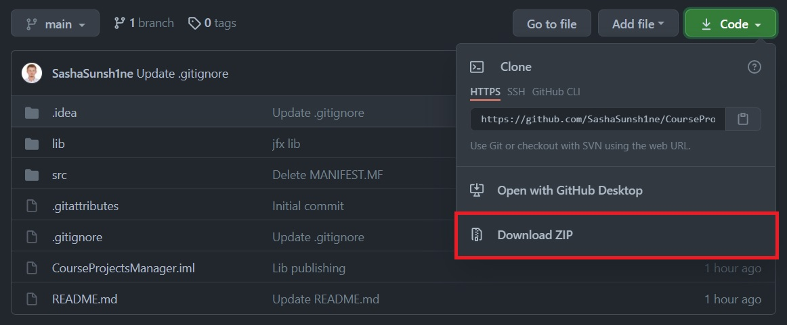
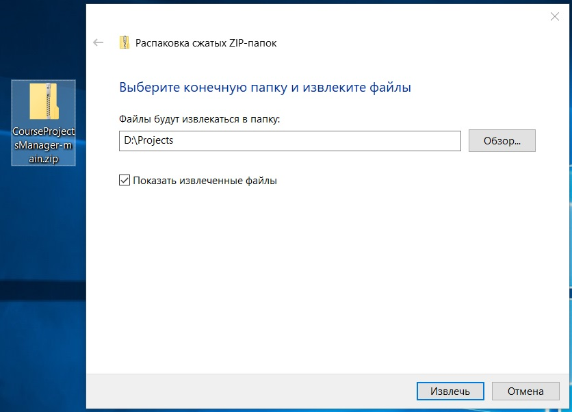
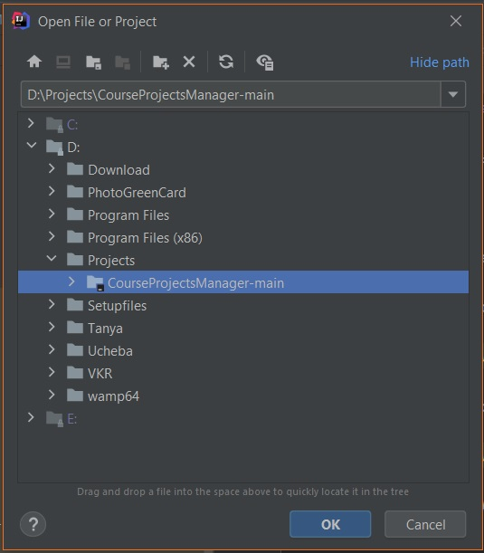
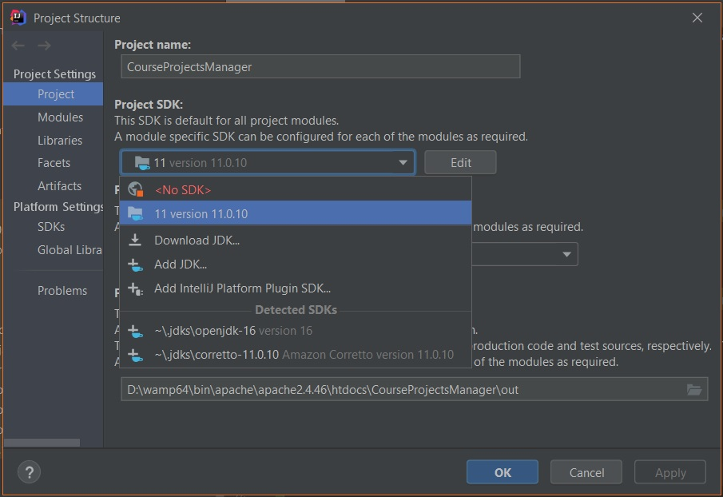
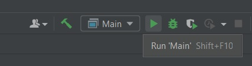

# CourseProjectsManager

Проект создан с помощью IDE IntelliJ IDEA на языке Java [[JDK 11]](https://www.oracle.com/ru/java/technologies/javase/jdk11-archive-downloads.html).

### # Запуск проекта

Для запуска проекта необходимо:

1) Скачать проект и сохранить его

2) Распаковать архив с проектом в удобное место

3) В IDE IntelliJ IDEA перейти в FILE > OPEN..., выбрать путь, куда был распакован проект, нажать на папку с проектом (CourseProjectsManager-main), затем на кнопку "OK"

### # Настройка проекта

#### ## FILE > Project Structure

В IDE IntelliJ IDEA перейти в FILE > Project Structure...
На вкладке Project открывшегося окна необходимо выбрать 11 версию Java.

### # Запуск

Для запуска проекта в IDE IntelliJ IDEA необходимо нажать > Run 'Main' (или применить сочетание клавиш SHIFT+F10)

